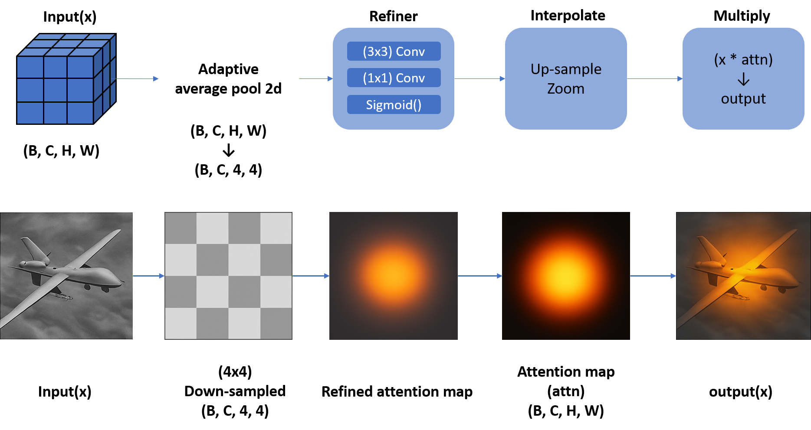
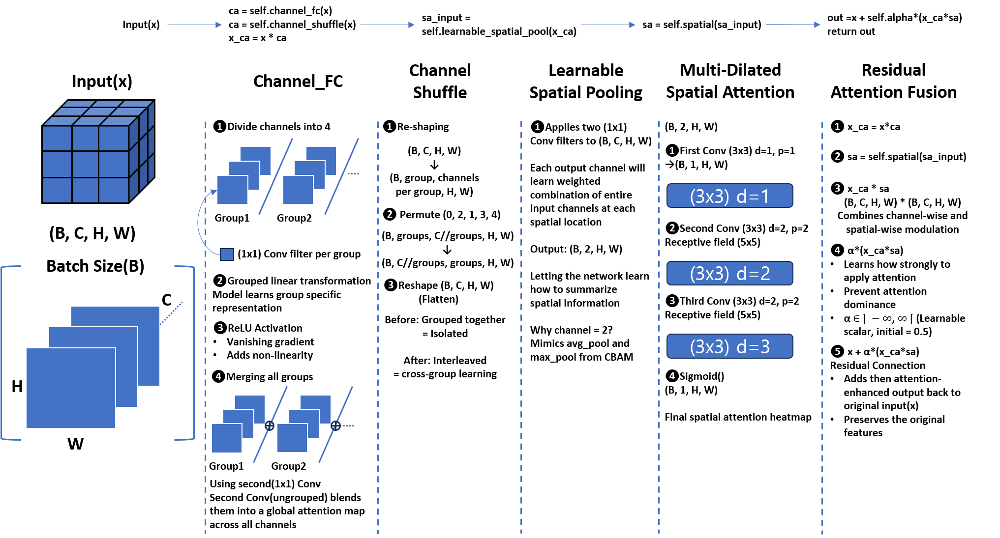
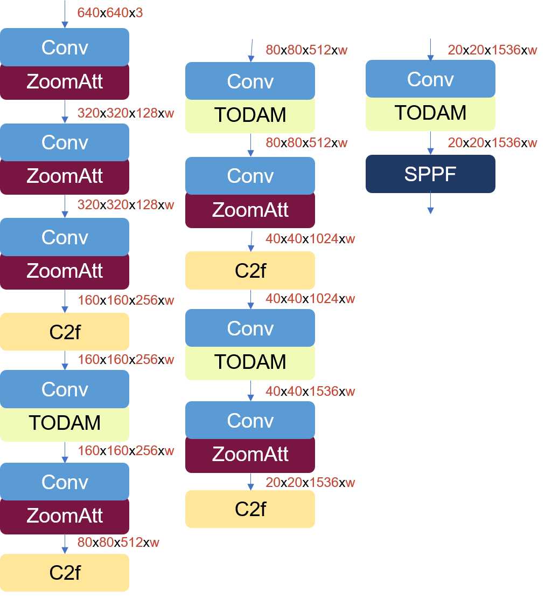

# Attention-module-for-tiny-object-detection
Introducing two attention modules, Zoom-Attention module and Tiny Object Detection Attention Module (TODAM), highly inspired by Squeeze-and-Excitation Block and designed for the enhancement of tiny object detection

### Python Library Installation
Following python libraries are required before starting the training
```python
pip install opencv-python
```
```python
pip install matplotlib
```
```python
pip install pandas
```
```python
pip install scipy
```
```python
pip install tqdm
```
```python
pip install opencv-python==4.8.1.78
```

## Zoom-Attention Module
<p align="center">
  
  <br>
  <em>The Zoom-Attention Module explanation</em>
</p>

## TODAM Module
<p align="center">
  
  <br>
  <em>The TODAM explanation</em>
</p>

## ZoomAtt-TODAMNet
<p align="center">
  
  <br>
  <em>The backbone diagram of ZoomAtt-TODAMNet</em>
</p>
